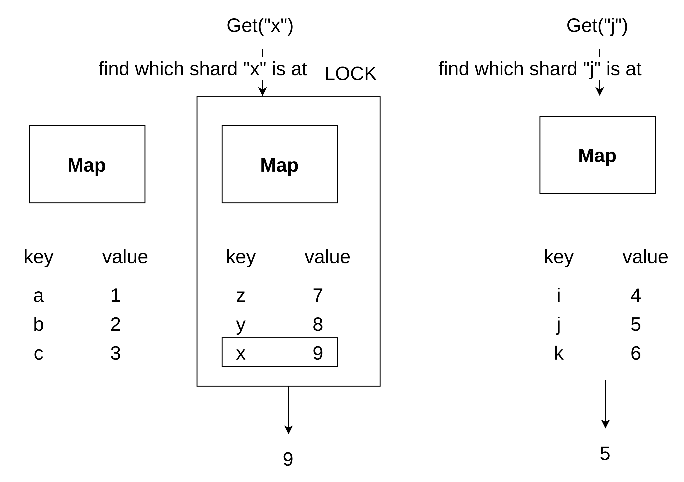

# thread-safe-cache

This repository is demo how to handle thread safety condition on map

## origin source code

```golang
package main

import "log"

type Cache map[string]any

func NewCache() Cache {
	return Cache{}
}

func (m Cache) Get(key string) (any, bool) {
	val := m[key]
	return val, val != nil
}

func (m Cache) Set(key string, value any) {
	m[key] = value
}

func (m Cache) Delete(key string) {
	delete(m, key)
}

func (m Cache) Contains(key string) bool {
	val := m[key]
	return val != nil
}

func (m Cache) Keys() []string {
	keys := make([]string, 0)
	for k := range m {
		keys = append(keys, k)
	}
	return keys
}


```

test with concurrency goruntime

```golang
package main

import (
	"fmt"
	"testing"
)

func TestCache(t *testing.T) {
	cache := NewCache()

	// concurrency fail race test
	for i := 1; i <= 10; i++ {
		go func(val int) {
			cache.Set(fmt.Sprint(val), val)
		}(i)
	}
}
```

test script
```shell
go test -v ./... --race
```
## refactor for race condition: Mutex

update the data structure

```golang
type Cache struct {
  sync.RWMutex
  data map[string]any
}
```

whole source code
```golang
package main

import (
	"log"
	"sync"
)

type Cache struct {
	sync.RWMutex
	data map[string]any
}

func NewCache() Cache {
	return Cache{
		data: make(map[string]any),
	}
}

func (m *Cache) Get(key string) (any, bool) {
	m.RLock()
	defer m.RUnlock()
	val := m.data[key]
	return val, val != nil
}

func (m *Cache) Set(key string, value any) {
	m.Lock()
	defer m.Unlock()
	m.data[key] = value
}

func (m *Cache) Delete(key string) {
	m.Lock()
	defer m.Unlock()
	delete(m.data, key)
}

func (m *Cache) Contains(key string) bool {
	m.RLock()
	defer m.RUnlock()
	val := m.data[key]
	return val != nil
}

func (m *Cache) Keys() []string {
	m.RLock()
	defer m.RLock()
	keys := make([]string, 0)
	for k := range m.data {
		keys = append(keys, k)
	}
	return keys
}

func RunCacheExample() {
	cache := NewCache()
	cache.Set("a", 1)
	cache.Set("b", 2)
	cache.Set("c", 3)
	keys := cache.Keys()
	for k := range keys {
		log.Printf("key: %v", k)
	}

	a, _ := cache.Get("a")
	log.Printf("a: %v", a)
	b, _ := cache.Get("b")
	log.Printf("b: %v", b)
	z, _ := cache.Get("z")
	log.Printf("z: %v", z)

	cache.Delete("a")
	cache.Delete("z")

	a, exists := cache.Get("a")
	log.Printf("a: %v, exists: %v", a, exists)
	for k := range keys {
		log.Printf("key: %v", k)
	}
}
```
## performance concern

use shard



## source code
```golang
package main

import (
	"crypto/sha1"
	"log"
	"sync"
)

type Shard struct {
	sync.RWMutex
	data map[string]any
}

type ShardMap []*Shard

func NewShardMap(n int) ShardMap {
	shards := make([]*Shard, n)
	for i := 0; i < n; i++ {
		shards[i] = &Shard{
			data: make(map[string]any),
		}
	}

	return shards
}

func (m ShardMap) getShard(key string) *Shard {
	// find index
	i := m.getShardIndex(key)
	return m[i]
}
func (m ShardMap) getShardIndex(key string) int {
	checksum := sha1.Sum([]byte(key))
	hash := int(checksum[0])
	i := hash % len(m)
  log.Printf("key: %v, index: %v", key, i)
  return i
}
func (m ShardMap) Get(key string) (any, bool) {
	shard := m.getShard(key)
	shard.RLock()
	defer shard.RUnlock()
	val := shard.data[key]
	return val, val != nil
}

func (m ShardMap) Set(key string, value any) {
	shard := m.getShard(key)
	shard.Lock()
	defer shard.Unlock()
	shard.data[key] = value
}

func (m ShardMap) Delete(key string) {
	shard := m.getShard(key)
	shard.Lock()
	defer shard.Unlock()
	delete(shard.data, key)
}

func (m ShardMap) Contains(key string) bool {
	shard := m.getShard(key)
	shard.RLock()
	defer shard.RUnlock()
	val := shard.data[key]
	return val != nil
}

func (m ShardMap) Keys() []string {
	keys := make([]string, 0)
	mutex := sync.Mutex{}
	wg := sync.WaitGroup{}

	wg.Add(len(m))
	for _, shard := range m {
		go func(s *Shard) {
			s.RLock()
			for k := range s.data {
				mutex.Lock()
				keys = append(keys, k)
				mutex.Unlock()
			}
			s.RUnlock()
			wg.Done()
		}(shard)
	}
	return keys
}

func RunCacheExample() {
	cache := NewShardMap(3)
	cache.Set("a", 1)
	cache.Set("b", 2)
	cache.Set("c", 3)
	keys := cache.Keys()
	for k := range keys {
		log.Printf("key: %v", k)
	}

	a, _ := cache.Get("a")
	log.Printf("a: %v", a)
	b, _ := cache.Get("b")
	log.Printf("b: %v", b)
	z, _ := cache.Get("z")
	log.Printf("z: %v", z)

	cache.Delete("a")
	cache.Delete("z")

	a, exists := cache.Get("a")
	log.Printf("a: %v, exists: %v", a, exists)
	for k := range keys {
		log.Printf("key: %v", k)
	}
}
```